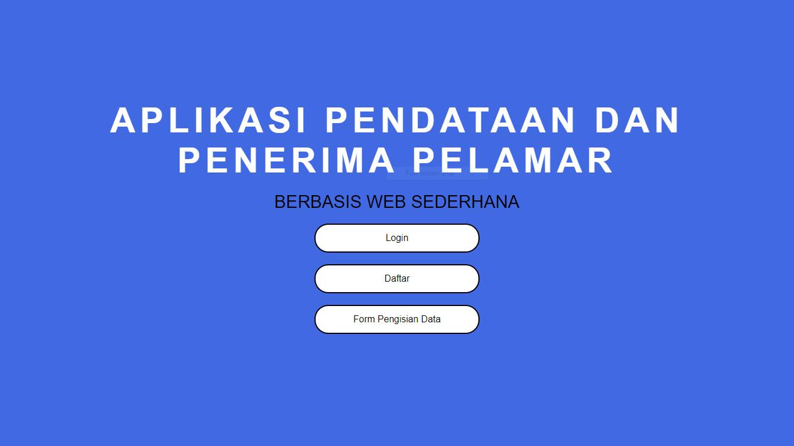

## Aplikasi Sangat Sederhana Pendataan Akta Tanah Sederhana

## Fitur Aplikasi

- Login 
- Register 
- Logout 
- Halaman Utama  
  A. Data Pelamar 
- Tambah Data (Data Pelamar) 
- Ubah Data (Data Pelamar) 
- Hapus Data (Data Pelamar) 
- Detail Data (Data Pelamar) 
- Print Data (Data Pelamar)  
  B. Jabatan 
- Tambah Data (Jabatan) 
- Ubah Data (Jabatan) 
- Hapus Data (Jabatan) 
- Detail Data (Jabatan) 
- Print Data (Jabatan)  
  C. Data Pelamar Yang Diterima 
- Tambah Data (Pemilik Tanah) 
- Ubah Data (Pemilik Tanah) 
- Detail Data (Pemilik Tanah) 
- Print Data (Pemilik Tanah) 
- Cari Data (Pemilik Tanah) 
  D. Data Pelamar Yang Ditolak 
- Tambah Data (Pemilik Tanah) 
- Ubah Data (Pemilik Tanah) 
- Detail Data (Pemilik Tanah) 
- Print Data (Pemilik Tanah) 
- Cari Data (Pemilik Tanah) 

## Aplikasi Screenshot

## Alat Yang Digunakan Untuk Membuat Web :

A. Hardware :
Laptop Aspire E1-472G. Speaksifikasi :

- Ram : 4GB DD3 L Memory
- Prosesor : Intel Core i5-4200U 1.6 GHz with Turbo Boost up to 2.5 GHz
- Tipe System : 64 bit
- VGA : NVIDIA GEFORCE GT 720M with 2GB Dedicated VRAM
- SSD : 128 GB

B. Software :

- XAMPP
- Sublime Text 3
- Bootstrap 4
- PHP 7.2
- MYSQL
